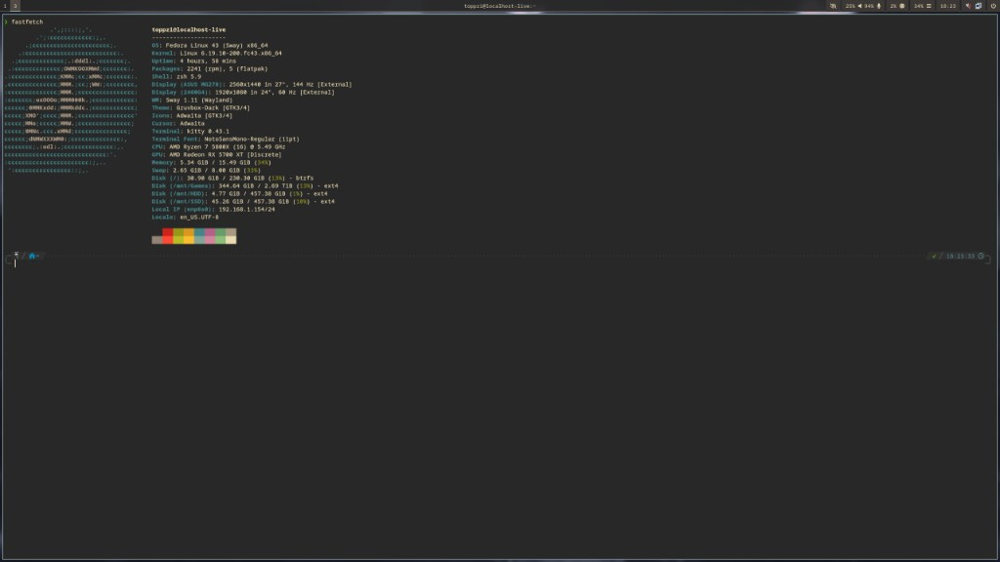
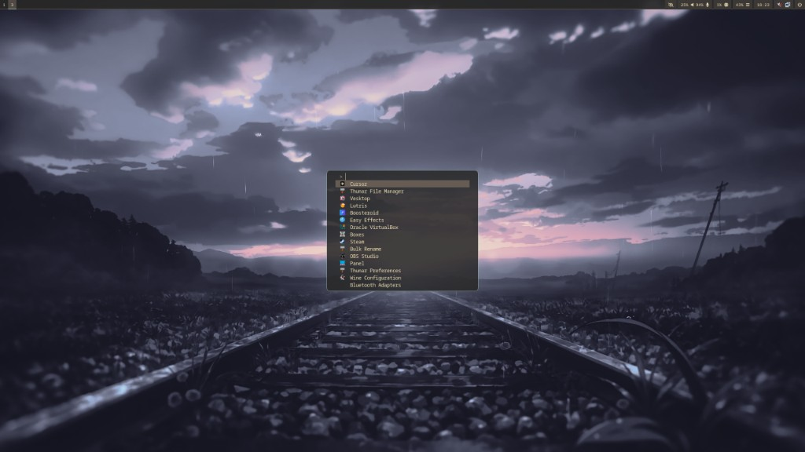
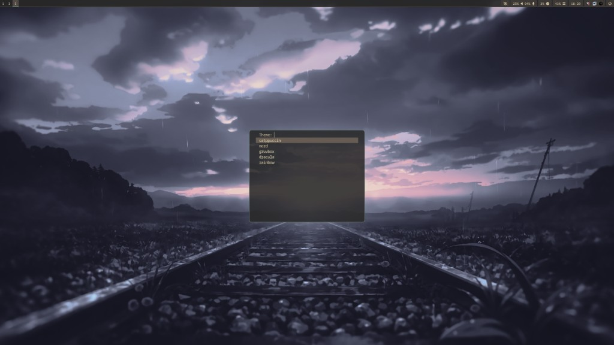
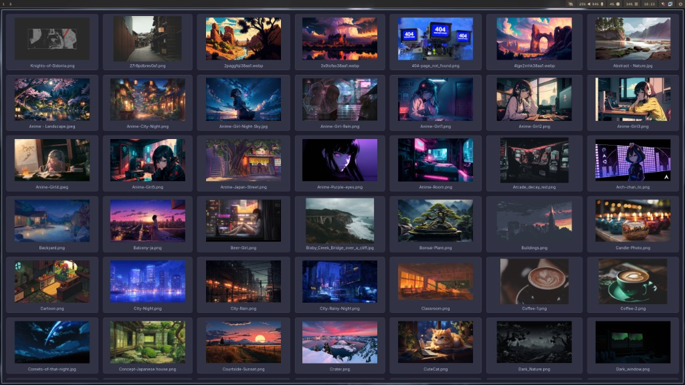
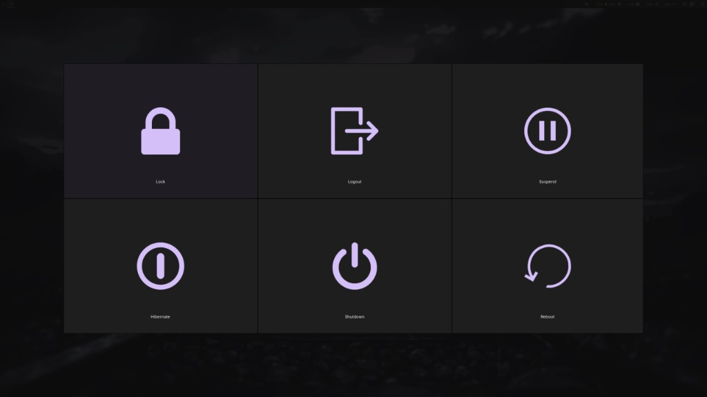

# swaydots

**Hyprland** dotfiles for **Fedora** (and similar setups): dynamic tiling compositor, **Waybar**, **Fuzzel** launcher, **Kitty** terminal, **wlogout**, wallpapers, screenshots, and a **unified theme switcher** with **18** dark and light palettes (Catppuccin variants, Nord, Gruvbox, Dracula, Tokyo Night, Solarized, One, Everforest, Rosé Pine, Rainbow, and more).

The `sway/` directory in this repo holds **shared** assets: wallpaper scripts, theme palettes, and **`theme-switch.sh`** (paths are historical; the installer targets **Hyprland** only).

Repository: [github.com/toppzi/swaydots](https://github.com/toppzi/swaydots)

## Screenshots

Fedora · **Hyprland** · Waybar · Kitty · Fuzzel · **Gruvbox** (and other themes via **Super+Shift+t**).

The shots below were taken with the same bar, terminal, and theme pipeline; your session runs under **Hyprland** and **`~/.config/hypr/hyprland.conf`**.

### Desktop, Waybar, and Kitty (`fastfetch`)



### Fuzzel application launcher (**Super+a**)



### Theme switcher (**Super+Shift+t**)



### Wallpaper grid picker (**Super+w**)



### wlogout (power menu from Waybar)



## Contents

| Path | Purpose |
|------|---------|
| `hypr/` | **`hyprland.conf`** — Waybar **`exec-once`**, polkit, keybinds (parity with the old Sway map), monitors (edit after install) |
| `sway/` | Wallpaper scripts + GTK picker, screenshots, **`theme-switch.sh`**, **`themes/`** (palettes + templates). Still copied to **`~/.config/sway/`** for those tools and themes. |
| `waybar/` | **`config-hyprland.jsonc`** is installed as **`~/.config/waybar/config.jsonc`** (Hyprland modules). **`style.css`** is regenerated by the theme switcher. |
| `wlogout/` | Layout and style (icons from the `wlogout` package) |
| `kitty/` | `kitty.conf` + **`themes/*.conf`**; active colours are **`themes/theme-active.conf`** |
| `fuzzel/` | Starter `fuzzel.ini` (overwritten when you change theme) |
| `install.sh` / `pack.sh` | Install into `~/.config` · pack from live config back into this tree |

Waybar can open **btop** in Kitty (`kitty -e btop`); the installer pulls in **btop** when using `dnf`.

## Install

```bash
cd /path/to/swaydots
chmod +x install.sh pack.sh
./install.sh
```

### What `./install.sh` does (Hyprland only)

1. Banner (ANSI colours on a TTY; set **`NO_COLOR=1`** to disable).
2. **Hyprland** — no desktop chooser; the script ensures **`hyprland`** and session packages are installed when **`dnf`** is available and **`--no-packages`** is not set. **`--compositor sway` is rejected**; **`--compositor hyprland`** is optional for scripts/CI.
3. **Login manager** — choose **SDDM**, **Ly**, **LightDM**, or **GDM** (default SDDM, or **q** to skip), or use **`--display-manager`** / **`--skip-display-manager`**. **Ly** may need the **[fnux/ly](https://copr.fedorainfracloud.org/coprs/fnux/ly/)** COPR; the installer can enable it and adjust **tty2** for Ly.
4. **Keyboard (XKB)** — interactive map (**us**, **se**, **gb**, **no**, …) unless **`--keyboard-layout`**. Writes **`~/.config/sway/config.d/10-xkb-layout.conf`** (for shared tooling) and sets **`kb_layout`** in **`~/.config/hypr/hyprland.conf`**.
5. **Wallpaper directory** — prompt or **`--wallpaper-dir`**; later written to **`environment.d`** and the folder is created if needed.
6. **`sudo dnf install`** (when **`dnf`** is used): **`dnf-plugins-core`**, Hyprland stack as needed, Waybar, wlogout, Kitty, Fuzzel, **btop**, grim/slurp, wl-clipboard, **gettext** (`envsubst`), wallpaper-picker deps, fonts.
7. **pavucontrol** if missing.
8. **Display manager** — **`dnf install`** for the chosen greeter (if any) and **`systemctl enable`**.
9. **Environment** — writes **`WALLPAPER_DIR`** to **`~/.config/environment.d/99-sway-dotfiles-wallpaper.conf`**, creates the wallpaper directory.
10. **Dotfiles** — backs up **`~/.config/{sway,waybar,wlogout,kitty,fuzzel,hypr}`**, copies from the repo, sets **Waybar** from **`config-hyprland.jsonc`**, applies keyboard to **`hyprland.conf`** / **`sway/config.d`**, **`chmod`** scripts, runs **`theme-switch.sh catppuccin --no-reload`** when possible.
11. **[linuxgamerlife/lgl-system-loadout](https://copr.fedorainfracloud.org/coprs/linuxgamerlife/lgl-system-loadout/)** COPR and **`lgl-system-loadout`** (see **Thanks**).

**Hyprland on Fedora:** if **`hyprland`** is not in the default repos, the installer enables **[solopasha/hyprland](https://copr.fedorainfracloud.org/coprs/solopasha/hyprland/)** and retries. See [Tutorial: Fedora 43 — Install Hyprland from scratch](https://discussion.fedoraproject.org/t/tutorial-fedora-43-install-hyprland-from-scratch/168386) if problems persist.

**After install:** log out and back in (or reboot) so **`environment.d`** applies. Reload config: **`hyprctl reload`**. Edit **`~/.config/hypr/hyprland.conf`** for monitors (**`hyprctl monitors`**) and binds ([Hyprland wiki](https://wiki.hyprland.org/Configuring/)).

### Installer flags

| Flag | Meaning |
|------|---------|
| `--dry-run` | Print actions only |
| `--no-packages` | Skip `dnf`; you install packages yourself |
| `--wallpaper-dir PATH` | Set wallpaper path without prompting (`~` expanded) |
| `--display-manager NAME` | Install **NAME** (`sddm`, `ly`, `lightdm`, `gdm`) without prompting |
| `--skip-display-manager` | Do not check, prompt, or install a display manager |
| `--compositor NAME` | Must be **`hyprland`** (optional); **`sway` is not supported** |
| `--keyboard-layout CODE` | XKB layout (e.g. `us`, `se`, `gb`, `no`; **`uk`** → **`gb`**) |
| `-h` / `--help` | Usage |

## Theme switcher

**18 themes** — run **`~/.config/sway/theme-switch.sh list`** for exact ids. Overview:

| Dark | Light |
|------|-------|
| catppuccin (Mocha), catppuccin-frappe, catppuccin-macchiato | **catppuccin-latte** |
| dracula, everforest-dark, gruvbox, nord, one-dark, rose-pine | **everforest-light**, **one-light**, **rose-pine-dawn** |
| solarized-dark, tokyo-night | **solarized-light**, **tokyo-night-day** |
| rainbow (multi-accent) | — |

Each run updates:

- **`~/.config/sway/config.d/40-theme.conf`** — kept for templates (Sway borders if you ever use Sway configs manually)  
- **`~/.config/waybar/style.css`**  
- **`~/.config/kitty/themes/theme-active.conf`**  
- **`~/.config/fuzzel/fuzzel.ini`**  
- **`~/.config/gtk-3.0/settings.ini`** and **`gtk-4.0/settings.ini`** — **Thunar** and other GTK apps  

The script runs **`hyprctl reload`** and signals Waybar/Kitty when possible.

| Action | How |
|--------|-----|
| Pick in a menu | **Super+Shift+t** |
| List names | `~/.config/sway/theme-switch.sh list` |
| Apply by name | `~/.config/sway/theme-switch.sh nord` (example) |

**Restart Thunar** if GTK chrome does not update.

**GTK:** Names in **`sway/themes/palettes/*.env`** (`GTK_THEME=…`) must match themes installed on your system. Light palettes often use **`Adwaita`**; dark ones **`Adwaita-dark`**. Adjust **`GTK_THEME`** per `.env` if you use Nordic, Dracula GTK, etc.

Palette keys and templates: **`sway/themes/README.md`**.

### Upgrading after `git pull`

Keep the full **`~/.config/sway/themes/`** tree (`palettes/` and **`tpl/`**). If **Super+Shift+t** breaks after an update, re-run **`./install.sh`** or copy:

```bash
cp -a /path/to/swaydots/sway/themes ~/.config/sway/
cp -a /path/to/swaydots/sway/theme-switch.sh ~/.config/sway/
chmod +x ~/.config/sway/theme-switch.sh
hyprctl reload
```

### Troubleshooting themes

- Needs **`fuzzel`**, **`gettext`** / **`envsubst`**, executable **`theme-switch.sh`**, and **`~/.config/sway/themes/`** as above.
- The keybinding runs **`/bin/bash $HOME/.config/sway/theme-switch.sh`**.
- Run **`~/.config/sway/theme-switch.sh list`** in a terminal; errors go to stderr and may use **notify-send**.

## After a fresh install

- **Monitors and workspaces:** **`~/.config/hypr/hyprland.conf`** — use **`hyprctl monitors`** and the [Hyprland docs](https://wiki.hyprland.org/Configuring/).
- **Apps:** set **`$terminal`**, **`$browser`**, **`$filemanager`** in **`hyprland.conf`** as needed.
- **`~/.config/sway/config`** is still installed for reference; the **running session** is **Hyprland**, not Sway.

## Pack (reverse sync)

```bash
./pack.sh
```

Rsyncs **`sway`**, **`waybar`**, **`wlogout`**, and (if present) **`kitty`**, **`fuzzel`**, **`hypr`** from **`~/.config`**. **`waybar/config-hyprland.jsonc`** is **excluded** so the repo template is not overwritten by a live-only **`config.jsonc`**.

## Thanks

Thanks to **[linuxgamerlife / lgl-system-loadout](https://github.com/linuxgamerlife/lgl-system-loadout)** for **LGL System Loadout**. The installer enables its COPR and installs **`lgl-system-loadout`** so you can extend your system beyond these dotfiles.

## Requirements

- **Hyprland** and a Wayland session.
- **`dnf`** is optional; without it, install the packages the installer would pull (see **`install.sh`** or the “dnf not found” warning).
- **INSTALL.txt** is a short summary; this **README** is the full guide.
